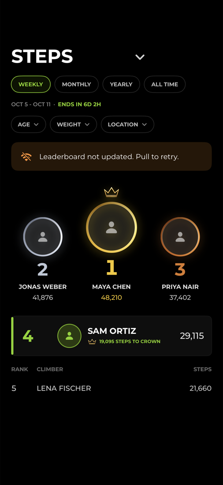
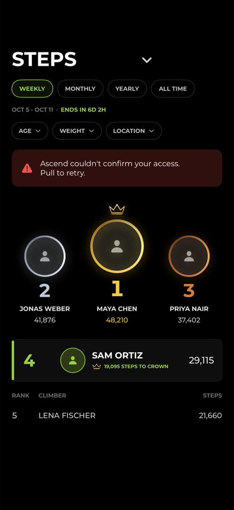
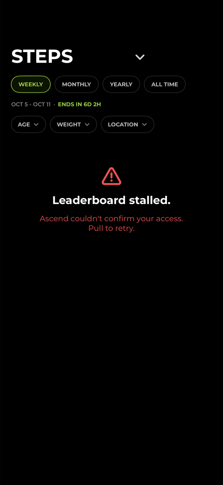
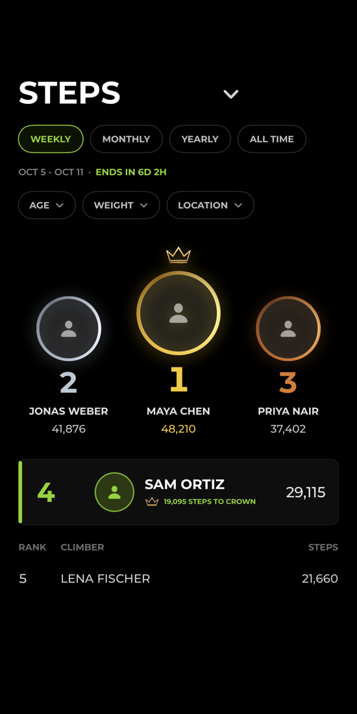

# Leaderboard refresh failures - evidence, 2026-10-05

What the Leaderboards tab shows, and what the device records, when a load cannot get the server's standings.

Before this change one sentence, `Showing cached data. Latest refresh failed.`, covered every Firestore error on a pull to refresh.
It appeared for a production rules outage on 2026-09-25 and again on 2026-10-03 when nothing was wrong: the phone's Firestore stream had dropped for about five minutes while the rest of its networking worked.
Neither left a record on the device.

## How it was driven

Headless throughout: the simulator was booted by `xcodebuild test`, never opened as a window.
The shipping `LeaderboardView` was hosted on a real `LeaderboardViewModel` in the Staging build (`ascend-staging-fa7d5`), signed out, and photographed with `RenderedScreen`.

Photographs 01 to 03 are **live**: the real `LeaderboardRepository`, the real Firestore SDK (11.15.0), the real two-second quiet retry and the real ten-second timeout.

- `Firestore.disableNetwork()` puts the SDK in exactly the state a dropped stream leaves it in while the phone stays connected, so a forced read fails at once with `unavailable` (14).
- Signed out, staging's rules refuse `leaderboard_stats`, so a forced read that reaches the server comes back `permissionDenied` (7): a real refusal from real rules.

Photograph 04 comes from the committed suite `AscendAppTests/LeaderboardRefreshFailureEvidenceTests.swift`, whose standings read is scripted, because a signed-out host cannot be given a server answer that succeeds.

## What each state shows

| | State | On screen | Recorded |
|---|---|---|---|
|  | **Stream down, pull to refresh.** The 2026-10-03 state, held down. An ordinary load in the same state showed the board with no line, exactly as before. | `Leaderboard not updated. Pull to retry.` over the last board, after 2.05 s: asked, waited, asked once more. | `warning`, `failure_class=unreachable`, `error_code=14`, `failed_attempts=2`, `resolution=stale_board` |
|  | **Rules refuse the read.** The 2026-09-25 state. Also what the board showed when the stream was restored 0.7 s into the quiet wait: the second ask reached the server, and signed out the server refused it, which is the proof the retry got through. | `Ascend couldn't confirm your access. Pull to retry.` over the last board. Reconciliation was asked for once. | `error`, `failure_class=refused`, `error_code=7`, `access_reconcile_attempted=true`, `resolution=stale_board` |
|  | **The same refusal with no copy of the board on the device.** | `Leaderboard stalled.` with the access line. | `error`, `failure_class=refused`, `resolution=empty_board` |
|  | **Stream down, back by the quiet retry.** 2026-10-03 as it actually went. | The board, and no line at all. | `warning`, `failure_class=unreachable`, `retry_recovered=true`, `resolution=recovered` |

Every row also sent one `leaderboard_refresh_failed` analytics event.

## Live transcript

From the lab run, trimmed to the lines about each refresh, with the Swift type prefix on `issue` removed.

```
LAB host auth uid=signed-out project=ascend-staging-fa7d5
LAB stream-down ordinary load -> message=nil rows=5
LAB stream-down pull-to-refresh -> message=Leaderboard not updated. Pull to retry. issue=unreachable rows=5 elapsed=2.045732083 seconds reconcileCalls=[]
LAB stream-down pull-to-refresh recorded code=leaderboard_refresh_failed severity=warning access_reconcile_attempted=false error_code=14 error_domain=FIRFirestoreErrorDomain failed_attempts=2 failure_class=unreachable forced=true network=wifi resolution=stale_board retry_recovered=false seconds_since_foreground=5 seconds_since_launch=5
LAB stream-down pull-to-refresh analytics event=leaderboard_refresh_failed
LAB stream restored 0.7 s into the quiet wait
LAB stream-returns pull-to-refresh -> message=Ascend couldn't confirm your access. Pull to retry. issue=refused rows=5 elapsed=2.294694083 seconds reconcileCalls=[true]
LAB stream-returns pull-to-refresh recorded code=leaderboard_refresh_failed severity=error access_reconcile_attempted=true error_code=7 error_domain=FIRFirestoreErrorDomain failed_attempts=3 failure_class=refused forced=true network=wifi resolution=stale_board retry_recovered=false seconds_since_foreground=13 seconds_since_launch=13
LAB rules-refused pull-to-refresh -> message=Ascend couldn't confirm your access. Pull to retry. issue=refused rows=5 elapsed=0.287406958 seconds reconcileCalls=[true]
LAB rules-refused pull-to-refresh recorded code=leaderboard_refresh_failed severity=error access_reconcile_attempted=true error_code=7 error_domain=FIRFirestoreErrorDomain failed_attempts=2 failure_class=refused forced=true network=wifi resolution=stale_board retry_recovered=false seconds_since_foreground=15 seconds_since_launch=15
LAB rules-refused empty -> message=Ascend couldn't confirm your access. Pull to retry. issue=refused rows=0 elapsed=0.336944042 seconds reconcileCalls=[true]
LAB rules-refused empty recorded code=leaderboard_refresh_failed severity=error access_reconcile_attempted=true error_code=7 error_domain=FIRFirestoreErrorDomain failed_attempts=2 failure_class=refused forced=true network=wifi resolution=empty_board retry_recovered=false seconds_since_foreground=16 seconds_since_launch=16
```

In the stream-returns run, `failed_attempts=3` reads as: `unavailable` locally, then a refusal from the server once the stream was back, then a second refusal after reconciliation was asked for.

## What was not driven

- A signed-in, entitled climber on a device.
  The simulator has no entitled session, so the path where a refusal is healed by reconciliation and the read then succeeds is covered by `LeaderboardRefreshFailureTests.aRefusalHealedByReconciliationShowsNothing` against a scripted read, not live.
- Production.
  Nothing here read or wrote `ascend-prod-9c8f2`.

## Every other read that insists on the server

About thirty more call sites forced `source: .server` and failed the same way in the same window.
All of them now go through the shared read and get its one quiet retry.
None of them falls back to the device's copy, because for each a stale answer would be wrong rather than merely old.
What the climber sees while the stream is down is therefore unchanged, and arrives about two seconds later only if the retry also fails.

| Read | Why the server's answer is required | What the climber sees while the stream is down |
|---|---|---|
| Climb Detail `ALL TIMES` board and its completion count | The rows can be cached and the count cannot, so a fallback would mix two sources on one board | `Leaderboard unavailable` in the board area |
| Climb Detail summary, finisher status, own best and rank | The rank is built from several counts | No personal rank and no First Ascent line; no copy |
| Live race window during a climb | The rank is built from several counts taken together | The last window stays; `Leaderboard unavailable` only when there is at most one row; the next tick asks again |
| Completion summary standing and its frozen snapshot | The standing is frozen permanently once read | No standing on the hero; nothing is frozen from an old copy |
| Publish status of a finished climb | It drives the publish phase | The climb reads as pending, which has no copy |
| Home globe finisher counts and stake line | Kept on the server for consistency with the board they summarise | The last answer stays; no copy |
| Ascend Mountain rivals' bests and checkpoints | A rival's position must be the published one | That rival is skipped and asked again on the next bucket |
| Ascend Mountain climber list | Same | `Couldn't load climbers. Tap to try again.` - whose button did nothing after a failed first load, fixed here |
| Unseen recaps, and marking a backlog seen | A stale "unseen" recap would show twice, and re-marking a seen one is refused by rules | No recap appears; the next app open asks again |
| Published routine templates | The sync deletes local templates missing from the answer | The routines already on the device |
| Ascend Mountain race filter | A save writes the difference from the stored set | The race includes everyone; a new choice holds for this climb only |
| Live climb community summary | No screen reads it today | Nothing |
| Whether a block already exists | A stale "exists" would report a block that was undone on another device | `The block didn't save. Check your connection and try again.` |
| Block list at launch | It already falls back to its cached list at once, so it takes no quiet retry: every other climber's name stays masked until it answers | The cached block list |
