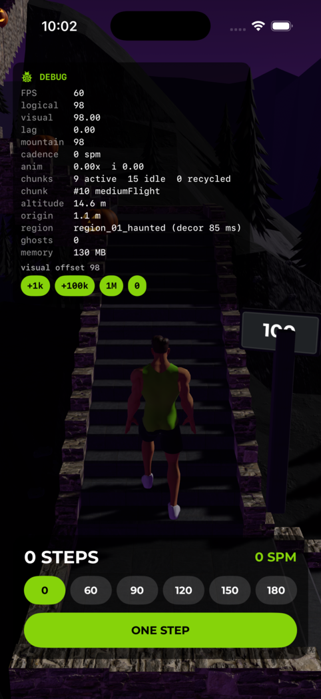
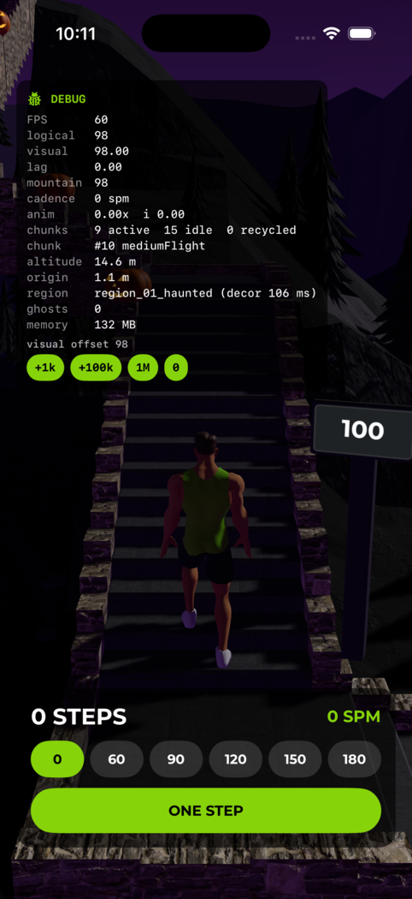
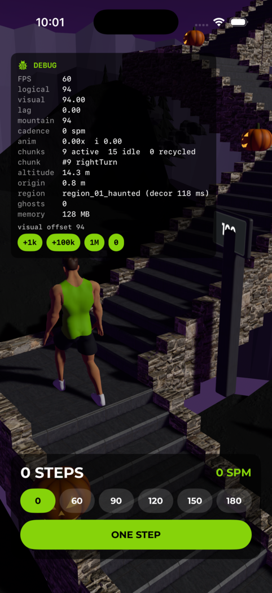
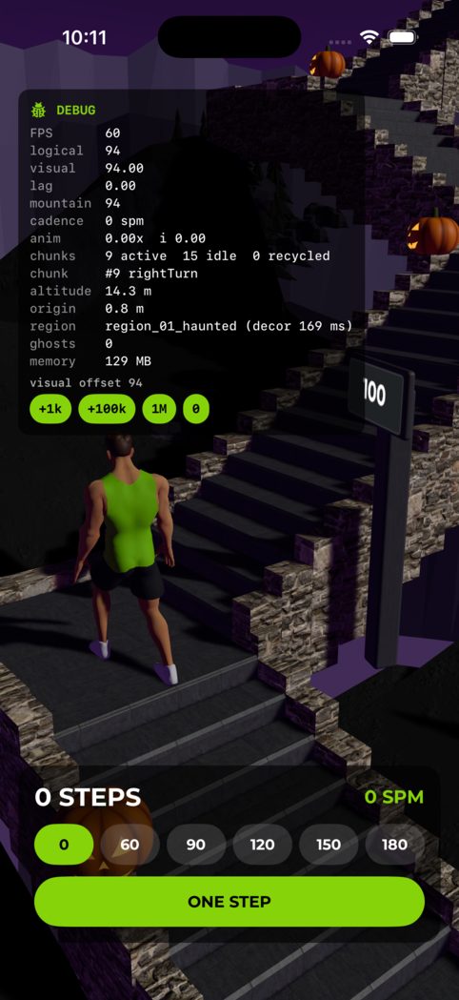
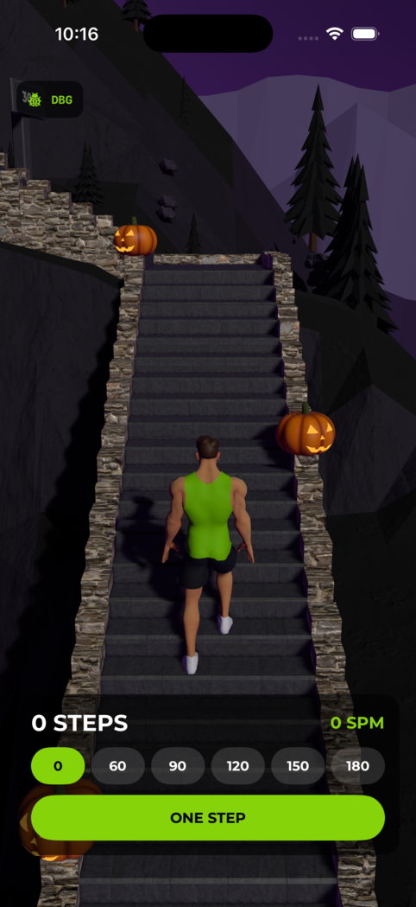

# Mountain trail post sign - evidence, 2026-10-09

What the step-count sign on every hundred-step trail post looks like from the climber's camera, before and after the post was moved behind it.

Before this change the sign hung through the shaft: the sign's centre sat inside the shaft's volume, so from the bottom of the sign to the shaft's top the post stood in front of the number.
The captain reported it on 2026-10-09: "the post that's sticking into the ground needs to be behind the sign so that you can actually see the step counts."

## How it was driven

Headless throughout: a lane-owned iPhone 17 Pro simulator booted with `xcrun simctl boot`, never opened as a window, photographed with `xcrun simctl io <udid> screenshot`.
The Dev build was launched into the Mountain sandbox, which drives the identical scene from a step clock, held still at a chosen visual step:

```
xcrun simctl launch <udid> com.TylerPavay.AscendApp.dev \
  -AscendMountainSandbox -AscendMountainSandboxSPM 0 \
  -AscendMountainSandboxOffset <steps> -AscendMountainDebugOverlayCollapsed 1
```

The same offsets were captured from the untouched build and from the fixed one.
The October haunted stretch is in effect in every photograph, because the sandbox starts at the climber's first steps; the post is the same in every season.

## What each photograph shows

| | Where | Before | After |
|---|---|---|---|
|   | **Two steps below the 100 post**, on a straight flight. | The shaft crosses the `00`. | `100` reads whole; the shaft disappears behind the sign. |
|   | **Six steps below the 100 post, mid-turn**, where the camera looks across at the sign. | The shaft covers the middle of the number. | `100` reads whole. |
|  | **Twenty-five steps below the 300 post**, seen across the turn ahead. | | `300` reads at distance; nothing of the post reaches it. |

## The contract

`AscendApp/Features/AscendMountain/Reality/MountainTrailPost.swift` holds the post's layout in its own frame, with the climber toward +z: the shaft ends at its half width, the board starts beyond it, and the face sits beyond the board.
`AscendAppTests/AscendMountainTrailPostTests.swift` pins it three ways - the numbers, the built entity's bounds, and the sight line from the real camera to every corner of the number across the first 1,250 steps of the course.
Put the sign back through the shaft and all three geometry tests fail.
